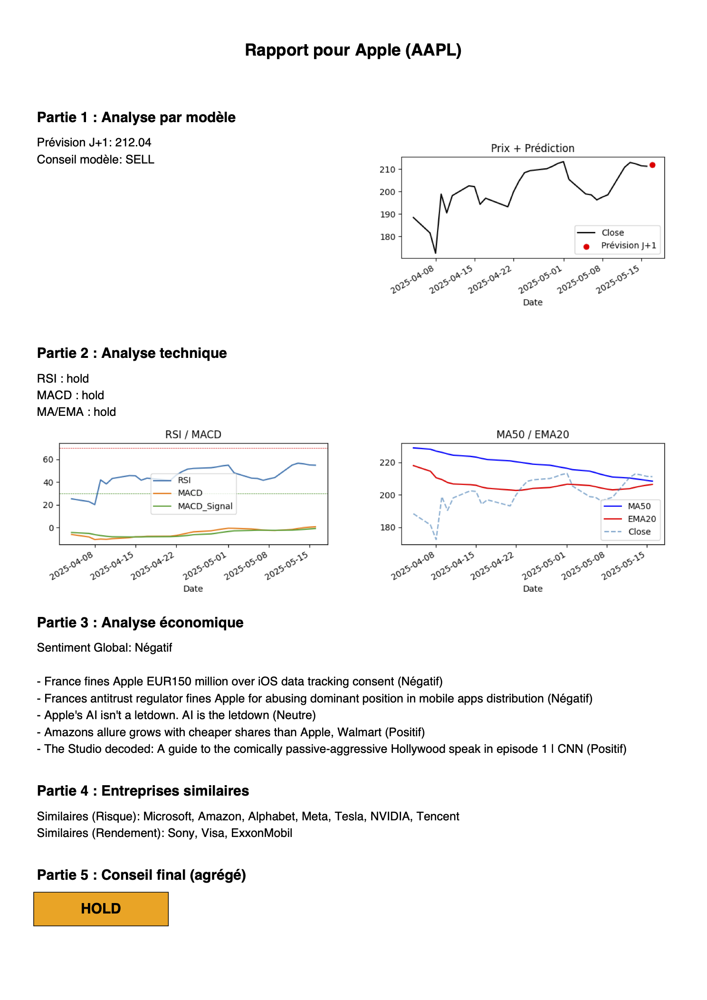

# 📊 Plateforme de Recommandation d’Investissement Assistée par IA

## 🔍 Objectif

Ce projet vise à construire une **plateforme intelligente** combinant plusieurs techniques de data science pour :

- Générer des **recommandations d’investissement** (Buy / Sell / Hold)
- Réaliser des **prévisions de rendement à court terme**
- Fournir des **analyses techniques** (RSI, MACD, moyennes mobiles)
- Analyser le **sentiment des actualités financières**
- Regrouper les entreprises similaires par **clustering**
- Générer automatiquement un **rapport PDF stylisé par entreprise**
  
---

## 📄 Exemple de rapport PDF



---

## 🏗️ Fonctionnement global

Le pipeline regroupe les travaux de 8 TPs (et plus), enchaînés automatiquement via un fichier `main.py`.  
Chaque exécution du pipeline génère un rapport d’analyse pour chaque entreprise, incluant :

- Prévision du cours J+1
- Conseil agrégé (technique, prédictif, sentiment)
- News récentes et analyse de sentiment
- Indicateurs techniques
- Liste d’entreprises similaires (clustering)

➡️ **Tous les rapports sont sauvegardés dans le dossier `pdf_reports/`**

---

## 🧠 Modules inclus

| Module                 | Description                                                                                                |
|------------------------|------------------------------------------------------------------------------------------------------------|
| `TP1.py`               | Scraping des ratios financiers et historiques de prix                                                      |
| `TP2.py`               | Clustering des entreprises (profil de risque et rendement)                                                 |
| `TP3.py`               | Classification Buy/Sell/Hold à partir d’indicateurs techniques                                             |
| `TP4.py`               | Régression (Lasso, Ridge…)                                                                                 |
| `TP5.py`               | Réseaux de neurones (LSTM) pour la prédiction                                                              |
| `TP6.py`               | Scraping de news financières                                                                               |
| `TP7.py`               | Fine-tuning BERT sur les sentiments                                                                        |
| `TP8.py`               | Classification des news avec le modèle fine-tuné                                                           |
| `TP_complementaire.py` | Fonctions utilitaires                                                                                      |
| `companies.py`         | Dictionnaire des entreprises à traiter : {"Nom": "Ticker"} — modifiable selon vos besoins                  |
| `grid.py`              | Dictionnaire des grilles de recherche d’hyperparamètres pour l’entraînement des modèles — personnalisable  |
| `main.py`              | Orchestration complète du pipeline                                                                         |


---

## 🖨️ Exemple de rapport PDF généré

Chaque fichier PDF contient :

- 📉 Une **prédiction visuelle** du cours J+1
- 📈 Un **résumé technique** (RSI, MACD, MA/EMA)
- 🗞️ Les **5 dernières actualités** avec leur tonalité
- 🧠 Une **recommandation finale** (Buy/Hold/Sell)
- 🔗 Une **liste d’entreprises similaires** selon le risque et la performance

---

## ⚙️ Installation

```bash
git clone https://github.com/ArnaudCrd/Investment_Pipeline_Clustering_NLP_Prediction.git
cd ton-projet
python -m venv env
source env/bin/activate  # ou env\Scripts\activate sous Windows
pip install -r requirements.txt
```

---

## 🚀 Exécution du pipeline

```bash
python main.py
```

Cela exécutera :

1. Récupération des données
2. Entraînement/prédictions
3. Génération de graphiques
4. Création automatique d’un **rapport PDF par entreprise**  
   ✅ dans le dossier `pdf_reports/`

---

## 📬 Contacts

```text
arnaud.cheridi@dauphine.eu
yanis.aoudjit@dauphine.eu
wayan.crain@dauphine.eu
```
